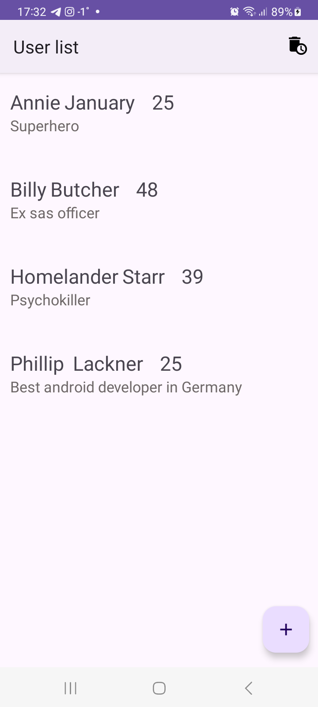
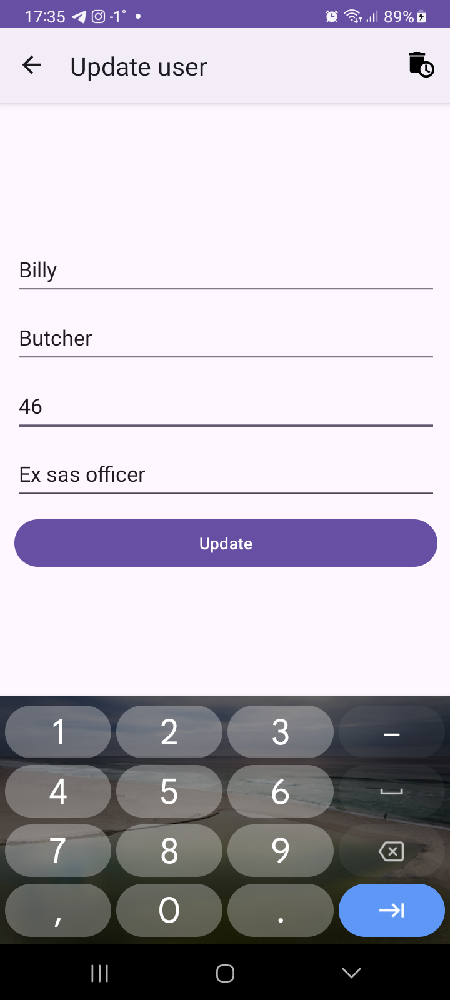
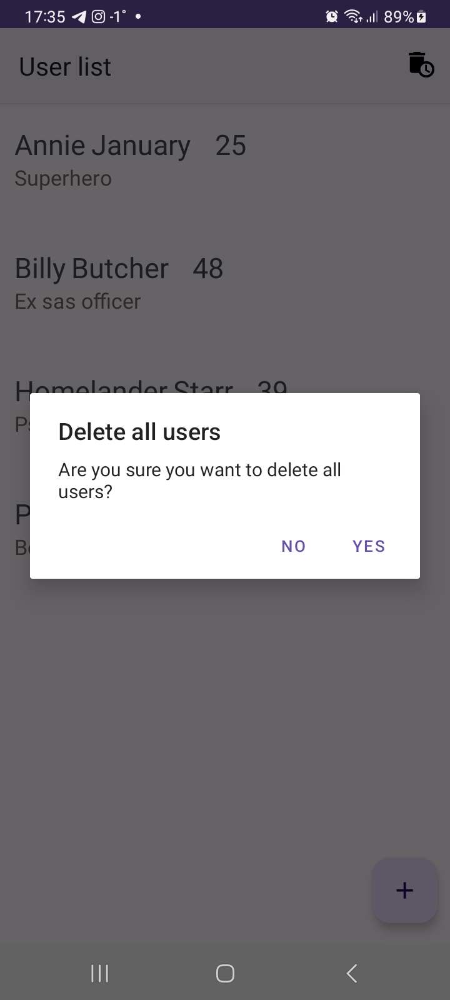

# Users DB 

- Basic database imitation that uses **Room** library to store data about users in device's SQLite database.  
- Requests to the DB are made by **suspend functions** inside **coroutines**.  
- Room's DAO methods return **LiveData** which are observed in the UI and updates to the UI are made accordingly.  
- Project follows **MVVM architectural pattern** using repository, view model, model classes for better app structure.  
    

